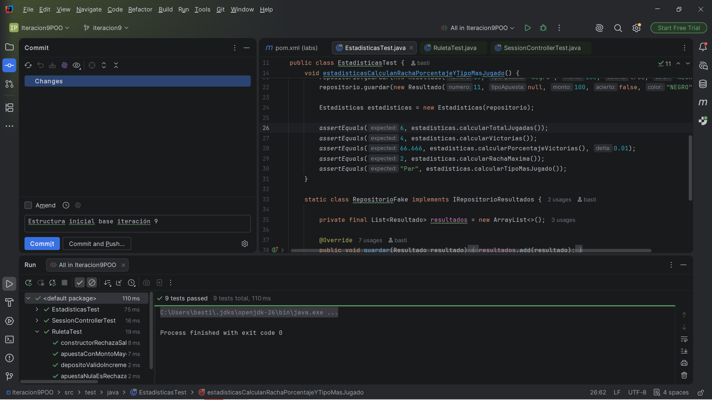

# Iteración 09: Pruebas Unitarias Automatizadas (UT) 
# Bastián Escobar POO RULETA 9

Este módulo contiene el diseño y la ejecución de la suite de pruebas unitarias automatizadas para el sistema de la Ruleta utilizando **JUnit 5** y **Maven**, asegurando la validación de las reglas de negocio críticas en el backend antes de su paso a producción.

---

## 📊 Resumen de Casos de Prueba Implementados

Se han automatizado rigurosamente los 7 casos de prueba prioritarios exigidos en la rúbrica del laboratorio:

1. **Constructor de Ruleta (Manejo de Errores):** Validación de que el sistema lance un `IllegalArgumentException` si se intenta instanciar un motor de ruleta con un saldo inicial negativo ($< 0$).
2. **Carga y Depósito Contable:** Verificación de que los depósitos positivos incrementen de forma exacta y matemática el saldo disponible.
3. **Control de Apuestas Nulas:** Bloqueo explícito de jugadas inválidas mediante excepciones al recibir un objeto de apuesta `null`.
4. **Validación de Límites de Saldo:** Control de transacciones para asegurar el rechazo inmediato de apuestas cuyos montos superen el saldo contable del jugador.
5. **Cálculo de Componente Estadístico:** Procesamiento de un historial mixto (con victorias, derrotas y valores nulos), verificando el correcto cálculo de la racha máxima, totales y la detección del tipo de apuesta más jugado.
6. **Seguridad y Acceso Negativo:** Validación en `SessionController` para garantizar el rechazo de intentos de inicio de sesión con credenciales de cuentas no registradas.
7. **Robustez de Identidad:** Control de fallos en el inicio de sesión y registro de usuarios cuando el identificador principal (`username`) posee un valor nulo.

---

## 🛠️ Tecnologías y Configuración del Entorno

* **Lenguaje:** Java 26
* **Framework de Pruebas:** JUnit 5 (Jupiter)
* **Gestor de Dependencias:** Maven
* **Componentes de Aserción:** `org.junit.jupiter.api.Assertions.*` (`assertEquals`, `assertThrows`, `assertFalse`)

---

## 📸 Evidencia de Ejecución Exitosa

A continuación se adjunta la captura de pantalla de IntelliJ IDEA que demuestra la correcta ejecución y aprobación de la suite completa de pruebas unitarias:

